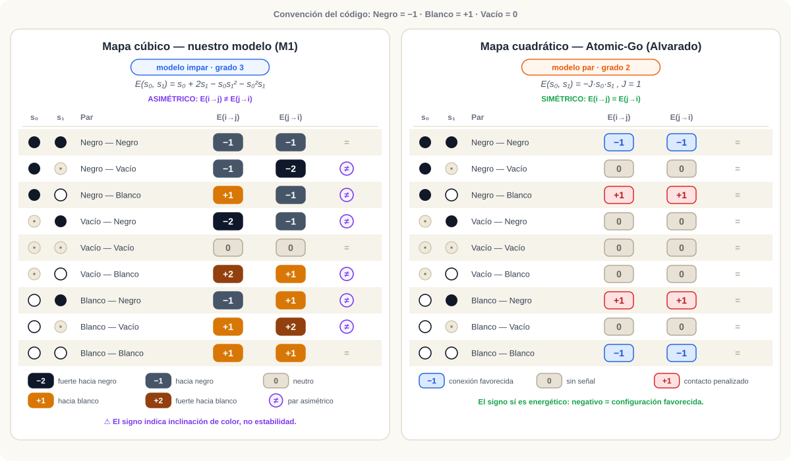
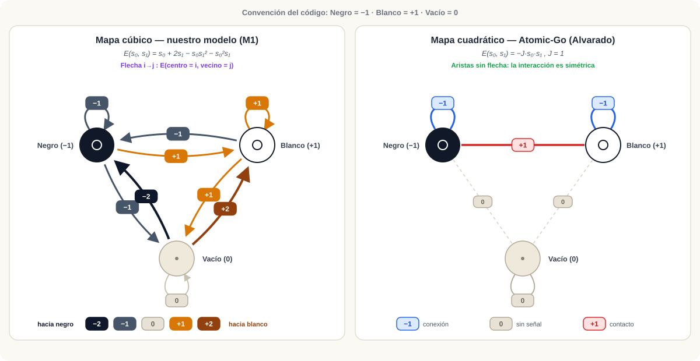
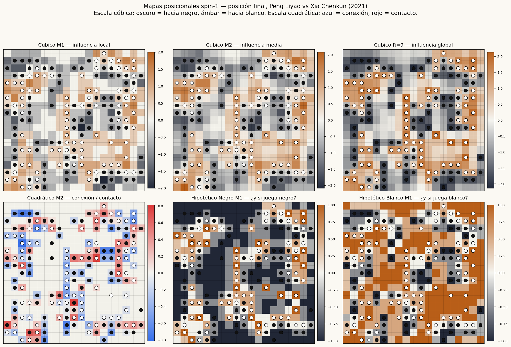
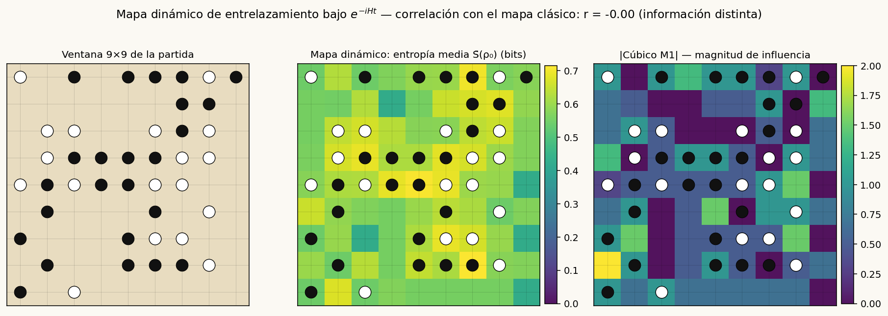
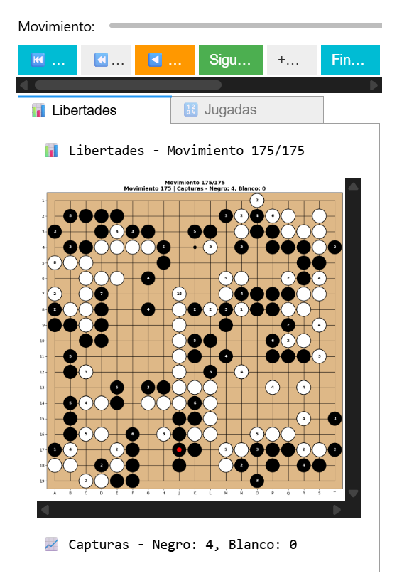
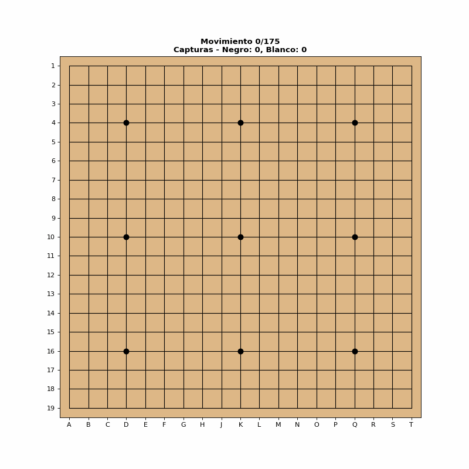

<p align="center">
  
</p>

<h1 align="center">Proyecto Quantum Go</h1>

<p align="center">
Modelos spin-1 y mapas posicionales para expresar influencia, libertad, conexión y estructura en el juego de Go.
</p>

<p align="center">
  <a href="https://www.python.org/downloads/"></a>
  <a href="LICENSE"></a>
</p>

---

Proyecto desarrollado inicialmente con el apoyo del Consejo Nacional de Ciencia y Tecnología (CONACYT) mediante la beca de Estancias Posdoctorales por México 2022, modalidad Académica - Inicial, CVU 469604.

- **Institución:** Facultad de Ingeniería, UNAM
- **LGAC:** Procesamiento Digital de Señales e Imágenes
- **Director de Proyecto:** Dr. Boris Escalante Ramírez
- **Período:** Diciembre 2022 - Noviembre 2024

**Autores**

- Dr. Mario Alberto Mercado Sánchez — ometitlan@gmail.com
- Leonardo Jiménez — leonsinmiedo@gmail.com
- Repositorio oficial: <https://github.com/ometitlan/Project-Quantum-Go>

---

## Visión general

Quantum Go explora una forma algebraica de expresar situaciones posicionales del juego de Go mediante variables spin-1. Cada intersección del tablero se representa como una variable ternaria

$$s_i\in\{-1,0,+1\},\qquad -1=\text{negro},\quad +1=\text{blanco},\quad 0=\text{vacío}.$$

La motivación central del proyecto no es asumir que Go pueda resolverse mediante una única energía global, sino construir un **lenguaje de representación**. Cada término algebraico permite expresar una lectura distinta del tablero: influencia, libertad local, conexión, corte, ocupación, presión territorial o extensión.

En esta etapa el proyecto compara **mapas posicionales** construidos con funciones locales sobre vecindades Manhattan. Se estudian dos familias básicas:

1. un **mapa cúbico**, asociado con influencia, ventaja local y acoplamiento color-ocupación;
2. un **mapa cuadrático** $s_0 s_1$, asociado con conexión, corte y estructura entre piedras.

Ambos mapas se calculan principalmente para Manhattan-1 y Manhattan-2, ponderando cada capa con $w_R = 1/R$ (es decir, $w_1 = 1$, $w_2 = 1/2$), de forma que las capas lejanas aportan menos sin desaparecer.

> **Idea principal:** spin-1 da el vocabulario, Manhattan da la geometría y los mapas dan la lectura posicional.

---

## Tabla de contenidos

- [Motivación](#motivación)
- [Codificación spin-1 del tablero](#codificación-spin-1-del-tablero)
- [Modelo general spin-1](#modelo-general-spin-1)
- [Mapa cúbico](#mapa-cúbico)
- [Mapa cuadrático](#mapa-cuadrático)
- [Comparación visual de los dos modelos](#comparación-visual-de-los-dos-modelos)
- [Capas Manhattan](#capas-manhattan)
- [Lectura sobre tablero actual y jugada hipotética](#lectura-sobre-tablero-actual-y-jugada-hipotética)
- [Galería: mapas sobre una partida profesional](#galería-mapas-sobre-una-partida-profesional)
- [Comparación conceptual de los mapas](#comparación-conceptual-de-los-mapas)
- [Forma general modificable](#forma-general-modificable)
- [Experimentos iniciales](#experimentos-iniciales)
- [Origen y línea cuántica](#origen-y-línea-cuántica)
- [Componentes del repositorio](#componentes-del-repositorio)
- [Demo visual](#demo-visual)
- [Inicio rápido](#inicio-rápido)
- [Estado actual](#estado-actual)
- [Licencia](#licencia)

---

## Motivación

El juego de Go contiene estructuras locales y globales difíciles de expresar con una sola regla. Una piedra puede ser fuerte o débil dependiendo de sus libertades, de su conexión con otras piedras, de la influencia de una pared, del balance territorial, de la cercanía de piedras enemigas o de la posibilidad de formar una buena extensión.

Por esta razón, en lugar de buscar una función única que pretenda describir todo el juego, este proyecto construye mapas posicionales. Cada mapa responde una pregunta distinta:

- ¿Dónde hay influencia negra o blanca?
- ¿Qué puntos vacíos están cerca de piedras propias?
- ¿Qué zonas expresan conexión o corte?
- ¿Qué posiciones tienen libertades locales?
- ¿Qué lectura cambia al pasar de Manhattan-1 a Manhattan-2?
- ¿Qué diferencia hay entre un término de ventaja y un término estructural?

---

## Codificación spin-1 del tablero

Cada punto del tablero se codifica con una sola variable ternaria $s_i \in \{-1, 0, +1\}$: negro $=-1$, blanco $=+1$, vacío $=0$ — la misma convención `STONE_TO_SPIN` del código, heredada del mapeo cuántico original (blanco $\to |0\rangle$ con $\langle Z\rangle=+1$, negro $\to |1\rangle$ con $\langle Z\rangle=-1$). Esta codificación es natural para el Go porque el tablero tiene exactamente tres estados básicos, y coincide con la estructura de los modelos spin-1 de la física estadística — en particular la familia Blume-Capel / Blume-Emery-Griffiths, donde las variables también toman valores $S_i \in \{-1,0,+1\}$.

La ventaja es que una sola variable separa **color**, **ocupación** y **vacío**:

$$s_i \rightarrow \text{color (con signo)},\qquad s_i^2 \rightarrow \text{ocupación},\qquad 1-s_i^2 \rightarrow \text{vacío},$$

porque

$$s_i^2 = \begin{cases} 1, & \text{si hay una piedra},\\ 0, & \text{si el punto está vacío}, \end{cases} \qquad\quad 1-s_i^2 = \begin{cases} 0, & \text{si hay una piedra},\\ 1, & \text{si el punto está vacío}. \end{cases}$$

A partir de estas piezas se pueden expresar libertades, influencia, conexión, ocupación conjunta y campos de ventaja.

---

## Modelo general spin-1

Una forma general de Hamiltoniano spin-1 para interacciones entre pares es

$$H= \sum_i h_i s_i + \sum_i D_i s_i^2 + \sum_{\langle i,j\rangle} \left[ J_{ij}\,s_i s_j + K_{ij}\,s_i^2 s_j^2 + L_{ij}\,s_i s_j^2 + M_{ij}\,s_i^2 s_j \right].$$

Cada término tiene una lectura distinta. En las tablas se mantiene siempre la convención: negro $=-1$, blanco $=+1$, vacío $=0$.

| Familia | Término | Qué mide | Lectura posicional en Go |
| :--- | :---: | :--- | :--- |
| Campo lineal | $s_i$ | Color con signo | Ventaja local orientada hacia negro o blanco. |
| Campo cuadrático | $s_i^2$ | Ocupación | Presencia de una piedra, sin importar su color. |
| Complemento de ocupación | $1-s_i^2$ | Punto vacío | Libertad o intersección disponible. |
| Par bilineal | $s_i s_j$ | Relación color-color | Conexión propia, corte o conflicto entre colores. |
| Par biquadrático | $s_i^2 s_j^2$ | Ocupación conjunta | Contacto, densidad o proximidad entre piedras. |
| Dipolo-cuadrupolo | $s_i s_j^2$ | Color de $i$ condicionado por ocupación de $j$ | Color central afectado por una presencia vecina. |
| Dipolo-cuadrupolo | $s_i^2 s_j$ | Ocupación de $i$ condicionada por color de $j$ | Punto ocupado leído desde el color del vecino. |

Esta tabla no pretende cerrar el modelo. Al contrario: funciona como una **gramática**. Cada término algebraico puede combinarse, ponderarse o modificarse para expresar una situación posicional diferente. Los términos impares $s_i s_j^2$ y $s_i^2 s_j$ son análogos a los acoplamientos dipolo-cuadrupolo de la literatura spin-1.

---

## Mapa cúbico

El primer mapa estudiado está dado por la función

$$E_{\text{cub}}(s_0,s_1) = s_0 + 2s_1 - s_0 s_1^2 - s_0^2 s_1,$$

donde $s_0$ es el punto central y $s_1$ un vecino dentro de una capa Manhattan. Mezcla términos lineales ($s_0$, $s_1$) con acoplamientos cúbicos color-ocupación ($s_0 s_1^2$, $s_0^2 s_1$).

El punto importante es que esta función **no debe leerse como una energía de estabilidad**: cambia de signo al intercambiar globalmente negro y blanco ($s \mapsto -s \Rightarrow E \mapsto -E$). Su lectura natural es:

> **Campo de influencia o ventaja local orientada hacia un color.** Valores negativos indican inclinación hacia negro; valores positivos, hacia blanco.

### Tabla de interacción del mapa cúbico

| Centro $s_0$ | Vecino $s_1$ | Valor $E_{\text{cub}}$ | Lectura posicional |
| :---: | :---: | ---: | :--- |
| Vacío<br>$0$ | Negro<br>$-1$ | $-2$ | Punto vacío con señal fuerte hacia negro. |
| Vacío<br>$0$ | Blanco<br>$+1$ | $+2$ | Punto vacío con señal fuerte hacia blanco. |
| Vacío<br>$0$ | Vacío<br>$0$ | $0$ | Punto vacío sin señal local. |
| Negro<br>$-1$ | Vacío<br>$0$ | $-1$ | Piedra negra con libertad local. |
| Blanco<br>$+1$ | Vacío<br>$0$ | $+1$ | Piedra blanca con libertad local. |
| Negro<br>$-1$ | Negro<br>$-1$ | $-1$ | Entorno favorable a negro. |
| Blanco<br>$+1$ | Blanco<br>$+1$ | $+1$ | Entorno favorable a blanco. |
| Negro<br>$-1$ | Blanco<br>$+1$ | $+1$ | Contacto inclinado hacia blanco. |
| Blanco<br>$+1$ | Negro<br>$-1$ | $-1$ | Contacto inclinado hacia negro. |

La señal siempre lleva signo de color: no conviene interpretarla como "bueno" o "malo" en términos absolutos, sino como una inclinación local.

### Caso especial: centro vacío

Si $s_0 = 0$, la función se reduce a $E_{\text{cub}}(0,s_1) = 2s_1$, de modo que sobre puntos vacíos el mapa cúbico es una suma ponderada del color de los vecinos:

$$M_{\text{cub}}(i) = \sum_j w_{ij}\, 2s_j.$$

Esto es un **mapa de influencia local**: negativo donde predominan piedras negras, positivo donde predominan blancas, cercano a cero donde se equilibran.

### Caso especial: centro ocupado o jugada hipotética

Si el centro tiene una piedra (real o hipotética) de color $\tau \in \{-1,+1\}$, entonces $s_0^2 = 1$ y la energía se reduce a

$$E_{\text{cub}}(\tau,s_1) = \tau\,(1-s_1^2) + s_1.$$

Esta forma separa dos contribuciones:

- $\tau(1-s_1^2)$: una **libertad local con signo del color jugado** — solo contribuye cuando el vecino está vacío;
- $s_1$: el **balance local de color** del vecino.

> **Convención de lectura:** el término $s_1$ no depende de $\tau$, así que el mapa hipotético queda siempre en unidades "blanco-positivo". Para rankear jugadas de negro se buscan los valores más negativos (equivalentemente, se ordena por $\tau \cdot M$). No hay que leer el mapa hipotético negro con la escala invertida sin esta corrección.

---

## Mapa cuadrático

El segundo mapa es el término cuadrático clásico de Ising — el mismo acoplamiento del modelo Atomic-Go de Alvarado et al. (2019):

$$E_{\text{quad}}(s_0,s_1) = -J\,s_0 s_1, \qquad J > 0.$$

Tiene naturaleza distinta al cúbico: es **invariante** bajo el intercambio global de colores, $E_{\text{quad}}(-s_0,-s_1) = E_{\text{quad}}(s_0,s_1)$. Por eso su lectura no es de ventaja negra o blanca, sino de **estructura**:

> **Conexión, corte, cohesión o contacto entre colores.** Mismo color: $-J$ (conexión favorecida). Colores opuestos: $+J$ (contacto enemigo penalizado). Algún punto vacío: $0$ (sin señal).

### Tabla de interacción del mapa cuadrático

| Centro $s_0$ | Vecino $s_1$ | Producto $s_0s_1$ | Valor $E_{\text{quad}}$ | Lectura posicional |
| :---: | :---: | ---: | ---: | :--- |
| Blanco<br>$+1$ | Blanco<br>$+1$ | $+1$ | $-J$ | Conexión blanca favorecida. |
| Negro<br>$-1$ | Negro<br>$-1$ | $+1$ | $-J$ | Conexión negra favorecida. |
| Blanco<br>$+1$ | Negro<br>$-1$ | $-1$ | $+J$ | Contacto enemigo penalizado. |
| Negro<br>$-1$ | Blanco<br>$+1$ | $-1$ | $+J$ | Contacto enemigo penalizado. |
| Vacío<br>$0$ | Piedra<br>$\pm1$ | $0$ | $0$ | Vacío sin acoplamiento estructural. |
| Piedra<br>$\pm1$ | Vacío<br>$0$ | $0$ | $0$ | Piedra junto a vacío; este mapa no puntúa libertades. |
| Vacío<br>$0$ | Vacío<br>$0$ | $0$ | $0$ | Par vacío-vacío neutral. |

Este mapa **no ilumina los vacíos del tablero actual**, porque $E_{\text{quad}}(0,s_1)=0$. Para usarlo como evaluador de jugadas hay que introducir una piedra hipotética en el centro.

### Mapa cuadrático como jugada hipotética

Para evaluar una jugada del color $\tau$ se reemplaza temporalmente $s_0 = 0$ por $s_0 = \tau$:

$$E_{\text{quad}}(\tau,s_1) = -J\,\tau s_1.$$

Si el vecino es propio ($\tau s_1 = +1$) el término vale $-J$: la jugada conecta. Si el vecino es enemigo ($\tau s_1 = -1$) vale $+J$: la jugada entra en contacto o conflicto. El mapa expresa la **compatibilidad estructural de una jugada con su entorno**, y su convención es la contraria al cúbico: aquí *más negativo = más conectado*, para ambos colores.

---

## Comparación visual de los dos modelos

Las dos láminas siguientes resumen el núcleo del proyecto: los mismos nueve pares centro–vecino producen lecturas distintas según la función local. Las tablas de las secciones anteriores dan los números; estas láminas dan la intuición.

**Tabla de interacción par por par.** Cada fila es un par centro–vecino $(s_0, s_1)$; las columnas $E(i\to j)$ y $E(j\to i)$ muestran la energía con cada punto en el rol de centro:

<p align="center">
  
</p>

**Grafo de interacción.** Los tres estados como nodos; cada flecha o arista lleva el valor de la interacción:

<p align="center">
  
</p>

Claves de lectura para estudiantes:

- **La escala de colores no significa lo mismo en cada panel.** En el mapa cúbico el signo es *inclinación de color* (tonos oscuros = hacia negro, tonos ámbar = hacia blanco); en el cuadrático el signo sí es *energético* (azul = conexión favorecida, rojo = contacto penalizado). Confundir ambas lecturas es el error más común.
- **El cúbico es asimétrico** (marcas $\neq$): $E(i\to j) \neq E(j\to i)$ porque el vecino pesa el doble ($2s_1$) y el centro responde distinto según su ocupación. El cuadrático es simétrico por construcción: intercambiar los roles no cambia nada.
- **El vacío distingue a los dos modelos.** En el cúbico, un vacío junto a una piedra recibe la señal más fuerte de toda la tabla ($\pm 2$): por eso "ilumina" territorio e influencia. En el cuadrático, cualquier par que involucre un vacío vale exactamente $0$: solo ve estructura ya construida (o jugadas hipotéticas).

Las láminas se regeneran con `python tools/generar_laminas_comparacion.py`; los valores provienen directamente de $E_{\text{cub}}$ y $E_{\text{quad}}$ con la convención del código (negro $=-1$, blanco $=+1$).

---

## Capas Manhattan

Para cada intersección $i$ se definen capas Manhattan

$$S_R(i)=\{\,j : d_1(i,j)=R\,\},$$

donde $d_1$ es la distancia Manhattan. En esta etapa se consideran principalmente $R=1$ y $R=2$:

- **Manhattan-1** — vecinos ortogonales inmediatos: contacto, libertades locales, conexión directa.
- **Manhattan-2** — segunda vecindad: forma corta, influencia de segundo orden, extensión inmediata.

### Ponderación inversa con la distancia

Los mapas usan una relación inversa con la distancia, $w_R = 1/R$, de modo que $w_1 = 1$ y $w_2 = 1/2$. El mapa general por capas es

$$M_{\phi}(i) = \sum_{R\in\mathcal{R}} \frac{1}{R}\, \frac{1}{|S_R(i)|} \sum_{j\in S_R(i)} \phi(s_i,s_j),$$

donde $\phi$ es la función local usada ($E_{\text{cub}}$, $E_{\text{quad}}$, u otra). La normalización por $|S_R(i)|$ evita que una capa domine solo por tener más puntos (y maneja de forma natural bordes y esquinas, donde las capas son más pequeñas); la ponderación $1/R$ controla la importancia relativa de la distancia.

**Nota de implementación:** el cálculo está vectorizado con convoluciones de anillos Manhattan, así que el radio $R$ es arbitrario — un tablero 19×19 con $R=9$ se calcula en ~3 ms, lo que hace viables los experimentos por lotes con radios grandes. El backend cuántico heredado queda acotado a $R\leq 2$: su kernel usa $1+2R(R+1)$ qubits y la simulación exacta crece como $2^n$.

---

## Lectura sobre tablero actual y jugada hipotética

Los mapas pueden calcularse de dos maneras.

### 1. Lectura sobre el tablero actual

Se usa el estado real del tablero, $s_i \in \{-1,0,+1\}$. Permite visualizar influencia actual, ocupación, contacto entre piedras, zonas de tensión, regiones dominadas por un color y estructura ya formada. En esta lectura el mapa cúbico ilumina también los vacíos ($E_{\text{cub}}(0,s_1)=2s_1$); el cuadrático no ($E_{\text{quad}}(0,s_1)=0$).

### 2. Lectura como jugada hipotética

Se evalúa qué pasaría si el jugador colocara una piedra de color $\tau$ ($-1$ negro, $+1$ blanco) en cada punto vacío. Entonces:

- $E_{\text{cub}}(\tau,s_j) = \tau(1-s_j^2) + s_j$ mide **libertad local + balance de color vecino**;
- $E_{\text{quad}}(\tau,s_j) = -J\,\tau s_j$ mide **conexión o conflicto** con las piedras vecinas.

---

## Galería: mapas sobre una partida profesional

Todo lo anterior, visto sobre una posición real — la posición final de **Peng Liyao vs Xia Chenkun (2021, 175 jugadas)**, incluida en `data/sgf partidas/`. Es lo que muestran las pestañas del navegador interactivo, sin necesidad de montar el entorno:

<p align="center">
  
</p>

Cómo leer cada panel:

- **Cúbico M1 → M2 → R=9** (fila superior): la misma función de influencia con radios crecientes. M1 lee el contacto inmediato; R=9 revela la **división territorial global** del tablero — las regiones oscuras y ámbar son las esferas de influencia de negro y blanco. Gracias a la vectorización por convoluciones, el panel R=9 cuesta ~3 ms.
- **Cuadrático M2**: solo estructura — cadenas azules donde hay conexión propia, focos rojos en los frentes de contacto entre colores. Los vacíos quedan sin señal, como predice la teoría.
- **Hipotéticos Negro / Blanco M1**: cada punto vacío evaluado como si ese color jugara ahí (libertad local + balance vecino). Nótese que son casi el negativo uno del otro, con las diferencias concentradas donde hay piedras cerca — exactamente el término $\tau(1-s_1^2)$ actuando.

La galería se regenera con `python tools/generar_galeria_readme.py` (mismo criterio que las láminas: los valores salen del modelo, no están dibujados a mano).

---

## Comparación conceptual de los mapas

| Criterio | Mapa cúbico | Mapa cuadrático $s_0s_1$ |
| :--- | :--- | :--- |
| Función local | $s_0+2s_1-s_0s_1^2-s_0^2s_1$ | $-J\,s_0s_1$ |
| Lectura principal | Influencia y ventaja local orientada por color. | Estructura: conexión, corte, contacto o conflicto. |
| Simetría de color | Cambia de signo al invertir negro/blanco; es impar. | No cambia al invertir negro/blanco; es par. |
| Centro vacío | Produce señal: $E_{\text{cub}}(0,s_1)=2s_1$. | No produce señal: $E_{\text{quad}}(0,s_1)=0$. |
| Jugada hipotética | Combina libertad local y balance de color vecino. | Mide conexión propia o contacto enemigo. |
| Escala de lectura | Negativo = inclinación hacia negro; positivo = inclinación hacia blanco. | Negativo = conexión favorecida; positivo = conflicto penalizado. |
| Aporta mejor en | Mapas de influencia, orientación territorial y presión local. | Mapas de cohesión, contacto, corte y compatibilidad estructural. |
| Riesgo interpretativo | Leer el signo como estabilidad absoluta. | Esperar que ilumine vacíos sin colocar una piedra hipotética. |
| Uso inicial recomendado | Influencia Manhattan-1/2 y lectura de vacíos. | Conexión Manhattan-1/2 y evaluación de jugadas. |

La diferencia principal es que el mapa cúbico produce señal de color incluso en puntos vacíos, mientras que el cuadrático requiere una piedra real o hipotética para producir señal. **No compiten como dos versiones de lo mismo: expresan aspectos distintos del tablero.**

---

## Forma general modificable

El proyecto se entiende como una familia abierta de funciones. La forma general de un mapa posicional es

$$M_{\phi,\tau}(i) = \sum_{R\in\mathcal{R}} \frac{1}{R}\, \frac{1}{|S_R(i)|} \sum_{j\in S_R(i)} \phi(\tilde{s}_i,s_j), \qquad \tilde{s}_i = \begin{cases} s_i, & \text{lectura del tablero actual},\\ \tau, & \text{lectura de jugada hipotética}, \end{cases}$$

con $\tau \in \{-1,+1\}$. Las funciones iniciales son $\phi_{\text{cub}}$ y $\phi_{\text{quad}}$; funciones futuras se agregan en la misma estructura:

$$\phi_{\text{lib}}(s_0,s_1),\qquad \phi_{\text{wall}}(s_0,s_1,R),\qquad \phi_{\text{risk}}(s_0,s_1),\qquad \phi_{\text{territory}}(s_0,s_1,R),\ \ldots$$

La intención es que cada función exprese una situación posicional específica.

---

## Experimentos iniciales

La primera comparación experimental debe generar, para cada posición SGF:

**Mapas sobre tablero actual**

1. Mapa cúbico Manhattan-1 y Manhattan-2.
2. Mapa cuadrático Manhattan-1 y Manhattan-2.

**Mapas de jugada hipotética** (para negro y para blanco)

1. Mapa cúbico de jugada Manhattan-1 y Manhattan-2.
2. Mapa cuadrático de jugada Manhattan-1 y Manhattan-2.

La comparación visual debe responder preguntas como:

- ¿Qué puntos ilumina el modelo cúbico que no ilumina el cuadrático?
- ¿Qué cambia al pasar de Manhattan-1 a Manhattan-2?
- ¿El mapa cuadrático captura conexión propia?
- ¿El mapa cúbico se comporta como influencia local?
- ¿Las jugadas reales de la partida caen en regiones destacadas por alguno de los mapas?

La última pregunta es la validación central: contrastar los máximos de los mapas hipotéticos contra las jugadas de partidas profesionales (y, más adelante, contra evaluaciones de un motor como KataGo) da una medida falsable de cuánta señal posicional captura cada término.

---

## Origen y línea cuántica

El proyecto nació explorando dos paradigmas de computación cuántica aplicados al Go: recocido cuántico (D-Wave, formulación Ising/QUBO) y computación fotónica (Xanadu, Gaussian Boson Sampling sobre grafos del tablero). Esa etapa dejó dos resultados que motivan la reorientación actual:

1. El "Hamiltoniano cuántico" evaluado sobre estados producto factoriza en expectativas por sitio, de modo que el mapa resultante es exactamente la función clásica spin-1 que hoy es el objeto central del proyecto. El formalismo cuántico funcionó como *dispositivo de derivación* del modelo cúbico.
2. La minimización global de una energía sin restricciones no responde a la dinámica adversarial y secuencial del juego; los mapas posicionales sí tienen una interpretación directa y verificable.

El cuaderno `notebooks/Hamiltonian_and_Ising_models.ipynb` documenta esta línea con su estatus actualizado: la derivación del modelo cúbico, la demostración del límite clásico, la **dinámica de entrelazamiento** bajo $e^{-iHt}$ (el único contenido genuinamente cuántico del proyecto) y la cuadratización exacta a QUBO. `notebooks/photonic_gbs_go.ipynb` conserva la exploración fotónica (GBS, hafnianos y subgrafos densos); la correlación de subgrafos GBS con evaluaciones de motores de Go sigue siendo una línea futura de interés.

### El mapa dinámico de entrelazamiento

Los términos $Z\otimes X$ y $X\otimes Z$ del Hamiltoniano no conmutan, así que la evolución $e^{-iHt}$ **entrelaza** el kernel: aparecen cantidades que ningún mapa clásico local puede reproducir — la entropía de von Neumann del qubit central $S(\rho_0)(t)$ y las correlaciones conectadas $\langle Z_0Z_j\rangle - \langle Z_0\rangle\langle Z_j\rangle$. `QuantumDynamicMapModel` resume esa dinámica en un escalar por punto (por defecto, la entropía media $\bar S$ sobre un ciclo):

<p align="center">
  
</p>

Sobre esta ventana 9×9 de la misma partida, el mapa dinámico correlaciona $r \approx 0$ con el mapa clásico: **mide información distinta**. La hipótesis falsable pendiente es si esa información tiene contenido de Go — si las jugadas reales de partidas profesionales caen en zonas de alta $\bar S$. El kernel cuántico está acotado a $R\leq 2$ (13 qubits; la simulación exacta crece como $2^n$).

---

## Componentes del repositorio

| Área | Ruta | Propósito |
| :--- | :--- | :--- |
| Código principal | `src/` | Paquete Python instalable: motor de Go, parser SGF, visualización y modelos de energía. |
| Exploración | `notebooks/` | Cuadernos Jupyter para análisis de partidas, mapas Manhattan y comparación de modelos. |
| Referencias | `bib/` | Artículos de referencia (Ising Graphical Model, Quantum Go Machine, finite-size scaling). |
| Recursos visuales | `data/assets/` | Imágenes para documentación, interfaz y reportes. |
| Datos SGF | `data/sgf partidas/` | Partidas profesionales en formato SGF para pruebas. |
| Resultados | `results/` | Salidas generadas: PNG, GIF, HTML y visualizaciones interactivas. |

**Componentes principales**

- **Motor de juego (`src/go_game_engine.py`)** — reglas de Go, capturas, suicidio, Ko, replay de partidas y estructuras de estado.
- **Utilidades SGF (`src/sgf_utils.py`, `src/board_utils.py`)** — carga de partidas, extracción de metadatos, conversión de movimientos a estados de tablero.
- **Visualización (`src/go_visualization.py`)** — navegación de partidas, jugadas, libertades y mapas posicionales.
- **Modelos de energía (`src/go_isings_models.py`)** — funciones locales tipo spin-1 y generadores de mapas Manhattan.
- **Mapas y exportación (`src/go_energy_viz.py`, `src/go_export_utils.py`)** — visualizaciones comparativas, PNG, GIF y HTML.

---

## Demo visual

<p align="center">
  
</p>

<p align="center">
  
  
</p>

La interfaz permite recorrer partidas SGF, mostrar números de jugada, libertades y mapas energéticos para distintas funciones locales. En la línea actual del proyecto, estos mapas se interpretan como **visualizaciones posicionales**, no como soluciones finales del juego.

---

## Inicio rápido

1. **Instala el paquete en modo editable:**

   ```bash
   pip install -e .
   pip install -r requirements.txt
   ```

2. **Abre el notebook de análisis interactivo** — `notebooks/go_sgf_analysis.ipynb`: carga partidas desde `data/sgf partidas/`, navega movimiento a movimiento y exporta PNG/GIF.

3. **Explora los modelos y mapas** — `notebooks/Hamiltonian_and_Ising_models.ipynb`: calcula mapas Manhattan-1/2 y compara las funciones locales.

```python
from src.go_game_engine import SGFParser
from src.go_visualization import GameNavigator

parser = SGFParser()
moves, info = parser.parse_file("data/sgf partidas/archivo.sgf")

navigator = GameNavigator(moves)
ui = navigator.create_view(figsize=(6, 6), include_energy_tabs=True, energy_backend='bokeh')
ui
```

O directamente la API de mapas, sin interfaz (vectorizada, cualquier radio):

```python
import numpy as np
from src.go_isings_models import PositionalMapModel, QuantumDynamicMapModel, EnergyMapGenerator

board = np.full((19, 19), '.', dtype=str)   # matriz de 'B' / 'W' / '.'

influencia   = PositionalMapModel('cubic', manhattan_distance=9).compute_map(board)
conexion     = PositionalMapModel('quadratic', manhattan_distance=2).compute_map(board)
jugada_negra = PositionalMapModel('cubic', manhattan_distance=1,
                                  hypothetical_color='B').compute_map(board)

# línea cuántica (R <= 2): entropía de entrelazamiento bajo e^{-iHt}
dinamico = EnergyMapGenerator(QuantumDynamicMapModel(manhattan_distance=1)).generate_energy_map(board)
```

---

## Estado actual

- [x] Motor de juego con validaciones y replay SGF.
- [x] Visualizaciones interactivas + exportación multimedia.
- [x] Mapa cúbico (Manhattan-1/2) implementado y verificado contra su derivación.
- [x] Convención de signos unificada entre código y documento: negro $=-1$, blanco $=+1$ (`STONE_TO_SPIN` en `src/go_isings_models.py`), heredada del mapeo cuántico a qubits.
- [x] Pesos y normalización alineados con este documento: $w_R = 1/R$ con normalización por capa.
- [x] Mapa cuadrático $-J s_0 s_1$ implementado como función local seleccionable (`quadratic`).
- [x] Lectura de jugada hipotética ($\tilde s_i = \tau$) integrada en notebooks e interfaz: sufijo `-hipB` / `-hipW` en las pestañas del navegador (p. ej. `m1-cubic-hipB`) y en los métodos de mapa (`cubic-hipB`).
- [x] Radio Manhattan generalizado y vectorizado: `PositionalMapModel.compute_map` calcula el tablero completo por convoluciones de anillos para cualquier $R$ (equivalencia exacta con el cálculo punto a punto, verificada; 19×19 con $R=9$ en ~3 ms, ~40× más rápido que el bucle).
- [x] Parte cuántica reestructurada: `Hamiltonian_and_Ising_models.ipynb` documenta la derivación, demuestra el límite clásico (factorización en estados producto, verificada a precisión de máquina) e implementa el **mapa dinámico de entrelazamiento** bajo $e^{-iHt}$ (`QuantumDynamicMapModel`: entropía de von Neumann del qubit central, correlaciones conectadas; Trotter de orden 2). En el tablero de prueba, el mapa dinámico correlaciona débilmente con los mapas clásicos (r ≈ 0.13–0.20): captura información distinta.
- [ ] Batería de experimentos iniciales sobre partidas SGF y comparación con jugadas reales — incluye validar si las jugadas reales caen en zonas de alta entropía del mapa dinámico.
- [ ] Mapa dinámico M2 (kernel de 13 qubits) y estadísticos alternativos (`entropy_max`, `conn_mean`, `z_mean`).

---

## Licencia

Código disponible bajo licencia [MIT](LICENSE). Si empleas este trabajo en publicaciones o demostraciones, incluye los créditos correspondientes y referencia este repositorio.
