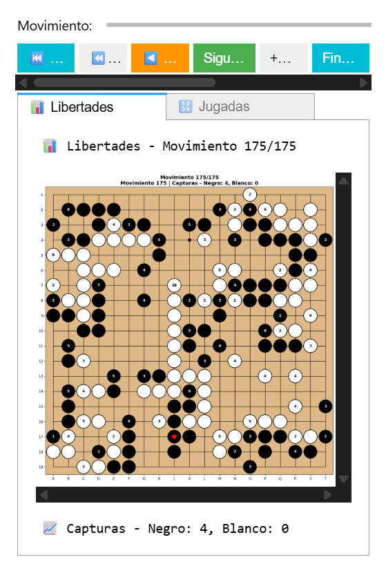
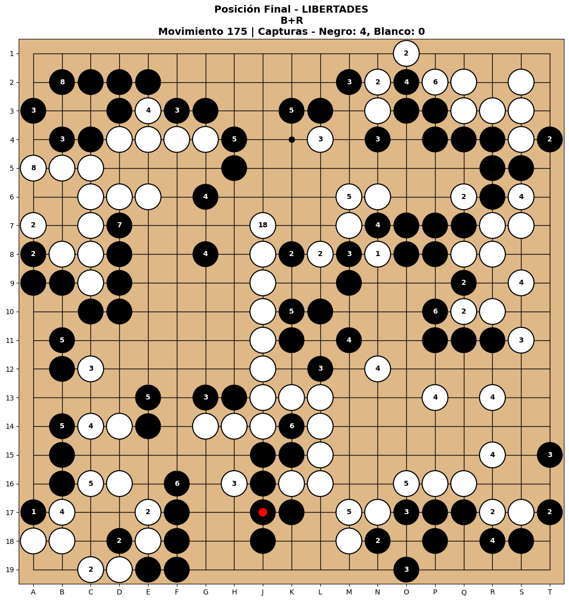
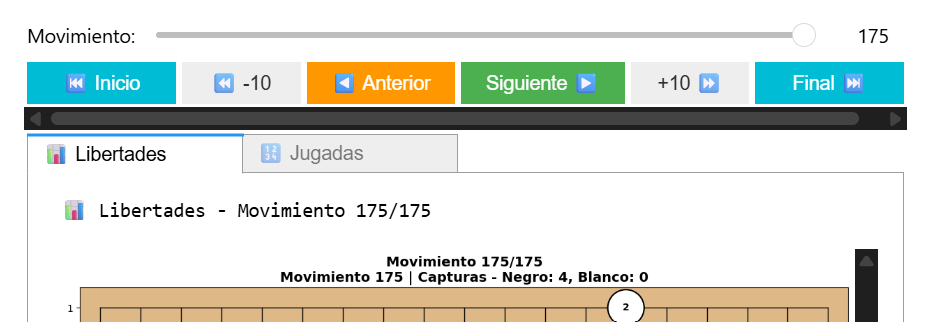
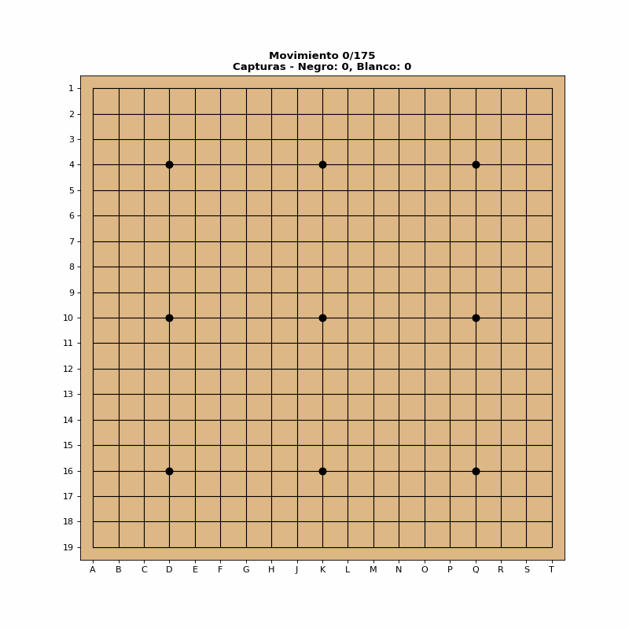
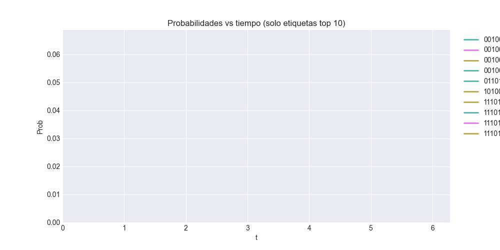
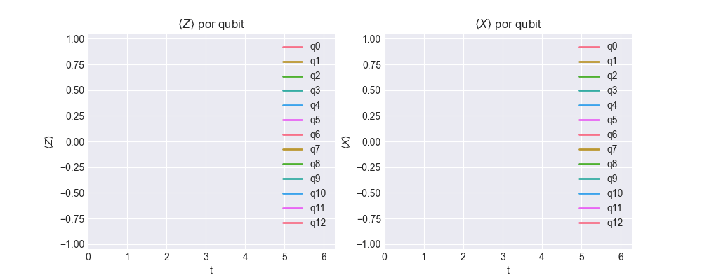

# Análisis Interactivo de Partidas de Go

Guía para cargar, analizar y visualizar partidas profesionales de Go con navegación interactiva y exportación de visualizaciones.

Interfaz de navegación interactiva con múltiples vistas

---

## Descripción

Este notebook proporciona una interfaz completa para:

- Cargar partidas profesionales en formato SGF
- Reproducir y validar todos los movimientos
- Navegar interactivamente por la partida
- Visualizar posiciones con libertades o números de jugada
- Exportar posiciones a imágenes PNG de alta calidad
- Generar animaciones GIF de partidas completas

---

## Estructura del notebook

### Celda 1: Configuración e imports
Carga todas las dependencias necesarias.

### Celda 2: Parsear archivo SGF y reproducir partida
- Define la ruta del archivo SGF a analizar
- Carga y valida el archivo
- Extrae metadatos y movimientos
- Muestra información completa de la partida
- Reproduce todos los movimientos
- Valida reglas (Ko, capturas, suicidio)
- Visualiza posición final con dos vistas:
  - Con libertades
  - Con números de movimiento

Ejemplo de visualización de posición final con libertades por grupo

Ejemplo de visualización de posición final con números de movimiento

### Celda 3: Navegador interactivo multi‑vista

Interfaz principal con controles de navegación y múltiples pestañas.

Controles disponibles:
- Inicio / Final
- -10 / +10 movimientos
- Anterior / Siguiente

Pestañas disponibles:

| Tab | Descripción | Utilidad |
|-----|-------------|----------|
| Libertades | Números = libertades de cada grupo | Análisis táctico, grupos en atari |
| Jugadas | Números = orden de movimiento | Seguir secuencias, estudiar aperturas |
| Energía | Preparado para modelos cuánticos | Análisis posicional (futuro) |

Interfaz

### Celda 4: Exportar posiciones a PNG

Exporta imágenes de alta calidad configurables.

Parámetros personalizables:
- Movimiento específico a exportar
- Mostrar libertades o números de jugada
- Calidad DPI (150/300/600)
- Exportar posición final

Archivos generados: `../results/*.png`

### Celda 5: Crear animación GIF

Genera animaciones completas de la partida.

Parámetros configurables:
- Velocidad de animación (ms por frame)
- Límite de movimientos (útil para partidas largas)
- Visualización en el notebook

Archivo generado: `../results/*.gif`

Animación de una partida completa

### Celda 6: Mapas de energía cuántica

Inserta los mapas de energía generados por los modelos de Ising (Manhattan‑1/2) en formato GIF para ilustrar rápidamente la distribución energética de una posición.

- Permite documentar resultados directamente en el notebook.
- Puede alternar entre kernels cuánticos y clásicos usando las utilidades de `src/go_energy_viz.py`.

Ejemplo de mapa M1 (cuántico) exportado desde `data/assets/quantum_map_M1.gif`.

### Celda 7: Evolución temporal del Hamiltoniano cuántico

Visualizaciones para observar cómo evoluciona el kernel bajo \( e^{-iHt} \) en el tiempo:

- Panel doble (dinámico + estado más probable):

  

- Probabilidades por estado (se etiquetan solo los 10 estados con probabilidad máxima):

  

- Expectativas por qubit: \( \langle Z_i \rangle(t) \) y \( \langle X_i \rangle(t) \):

  

### Módulos utilizados

#### `go_game_engine.py` — Motor del juego

Características principales:

| Componente | Capacidades |
|------------|-------------|
| GoBoard | Motor completo con validación de reglas |
| Reglas | Ko, capturas, suicidio, superko |
| Análisis | Libertades, grupos, capturas |
| Replay | Reproducción completa de partidas |
| SGFParser | Parser robusto de archivos SGF |
| Metadata | Jugadores, fecha, resultado, komi |
| Movimientos | Extracción de secuencias |
| Comentarios | Preservación de anotaciones |

Validaciones implementadas:
- Ko simple y superko
- Detección de suicidio
- Captura de grupos sin libertades
- Validación de posiciones legales

---

#### `go_visualization.py` — Visualización

Características principales:

| Componente | Capacidades |
|------------|-------------|
| GoBoardVisualizer | Renderizado de tableros |
| Matplotlib | Visualización estática de alta calidad |
| Bokeh | Visualización interactiva web (opcional) |
| Libertades | Números en grupos |
| Movimientos | Orden de jugada |
| Heatmaps | Mapas de calor de libertades |
| GameNavigator | Navegación interactiva |
| Controles | Slider + botones de navegación |
| Tabs | Sistema escalable de múltiples vistas |
| Callbacks | Actualización sincronizada |
| Funciones Export | Exportación de visualizaciones |
| PNG | Imágenes de alta calidad (hasta 600 DPI) |
| GIF | Animaciones completas |
| Comparación | Vista lado a lado |

---

## Próximas características

- Integración con modelo cuántico (pestaña de Energía)
- Análisis de influencia y territorio
- Gráficas de ventaja durante la partida
- Detección automática de joseki
- Exportación a formato personalizado

---

## Recursos

Descargar partidas profesionales:
- GoKifu: https://gokifu.com/ — Partidas de torneos
- Waltheri: http://ps.waltheri.net/ — Base de datos masiva
- OGS: https://online-go.com/ — Partidas en línea

Formato SGF:
- Especificación SGF: https://www.red-bean.com/sgf/

---

## Licencia

El código de este repositorio se distribuye bajo MIT (ver `LICENSE`).

—

Creado con cariño para la comunidad de Go
